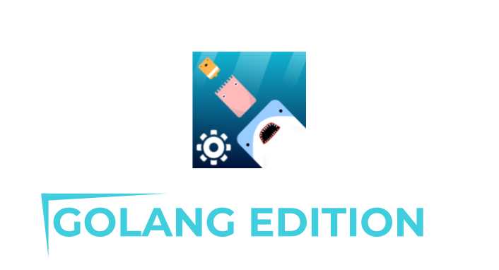

[](https://forthebadge.com) [](https://forthebadge.com) [](https://discord.gg/BMHVrKYeem)

# Deeeep.io Desktop Client



> **NOTE**: the [electron edition](https://github.com/SirReadsALot/Deeeep.io-Desktop-Client/tree/electron) was the default version before we switched to golang because of some drawbacks of electron.

Welcome to the official repository of the Deeeep.io Desktop Client!

The Deeeep.io Desktop Client is a free and open source desktop app made with go for the hit io game called Deeeep.io.

## Supported Platforms

| Version | Platform | Availability| 
| ------- | -------- | ----------- |
| v1.7  | Windows  | Coming Soon | 
| v1.7    | MacOS    | Coming Soon |
| v1.7    | Linux | Coming Soon |


## Installation

This application requires [go](https://go.dev/) to be installed.

To download this repository:

> This step requires Git to be installed
```
git clone https://github.com/SirReadsALot/Deeeep.io-Desktop-Client.git
cd Deeeep.io-Desktop-Client
```

Run the app using:
```
go run main.go
```

Build the app using:
```
go build -o dist/Deeeep.io-Desktop-Client.exe
```
## Contributing

To gain access to this repository, contact `SirReadsALot#3380` on Discord.

You are also welcome to submit a pull request or issue at any time.

Join our [Discord server](https://discord.gg/BMHVrKYeem) or check out our [website](https://sralcodeproj.netlify.app/deeeep.io_desktop_client).

## License

The Deeeep.io Desktop Client is licensed under the GPL-3.0 license.
